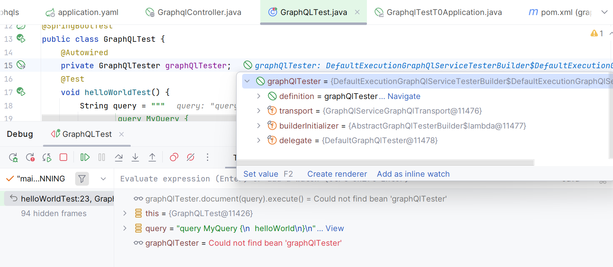

# Spring Debugger fails to resolve `GraphQlTester` bean 

https://youtrack.jetbrains.com/issue/IDEA-378195

Comment-out `@EnableFeignClients` and start to debug the test:
`GraphQlTester` bean is resolved successfully

Uncomment `@EnableFeignClients` and start to debug the test:
`GraphQlTester` bean is shown as not found in the Debugger toolwindow,
though the Editor inlay displays it correctly:

